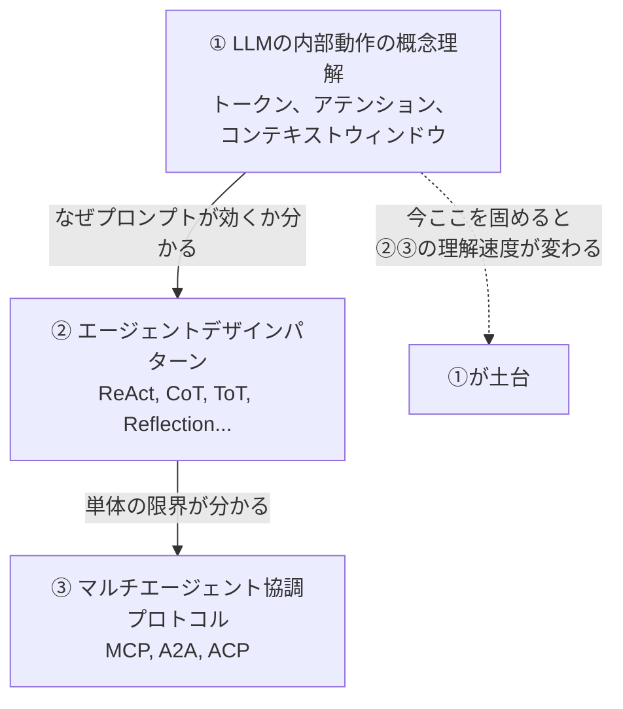

<h1 align="center">Hi 👋 I'm shuji-bonji</h1>

<b>TypeScript / Web技術が好きなエンジニア🐱</b>

## MCP Server

### Standards Knowledge（標準規格の知識提供）

-  : [PDF SPEC MCP Server](https://github.com/shuji-bonji/pdf-spec-mcp) : ISO 32000（PDF）仕様書への構造化アクセスを提供する MCP（Model Context Protocol）サーバーです。LLM が PDF 仕様書をナビゲート・検索・分析するためのツールを提供します。
  - → 実装: [PDF Reader MCP Server](https://github.com/shuji-bonji/pdf-reader-mcp) — 仕様に基づくPDF内部構造解析
-  : [Web Compat MCP Server](https://github.com/shuji-bonji/web-compat-mcp) : Web Platform 全体のブラウザ互換性データを提供する MCP サーバーです。「この機能、本当にブラウザで動くの？」 という質問に答えます。
-  : [W3C MCP Server](https://github.com/shuji-bonji/w3c-mcp) : W3C/WHATWG/IETF の Web 仕様にアクセスするための MCP Server です。
-  : [RFCXML MCP Server](https://github.com/shuji-bonji/rfcxml-mcp) : RFC 文書を AIが構造的に理解 するための MCP サーバー
-  : [IFC Core MCP Server](https://github.com/shuji-bonji/ifc-core-mcp) : IFC4.3 仕様リファレンス MCP サーバー — IFC エンティティ定義・属性・継承関係・PropertySet を検索・参照するための MCP サーバーです。
-  : [EPSG MCP Server](https://github.com/shuji-bonji/epsg-mcp) : 座標参照系（CRS: Coordinate Reference System）に関する知識提供を行うMCPサーバーです。

### Quality & Analysis Tools（品質評価・分析ツール）

-  : [PDF Reader MCP Server](https://github.com/shuji-bonji/pdf-reader-mcp) : PDF 内部構造解析に特化した MCP (Model Context Protocol) サーバー。[PDF SPEC MCP Server](https://github.com/shuji-bonji/pdf-spec-mcp) の仕様知識に基づく実装です。
-  : [xCOMET MCP Server](https://github.com/shuji-bonji/xcomet-mcp-server) : xCOMET（eXplainable COMET）を利用した、翻訳品質評価を AI エージェントから行えるようにした、MCP サーバーです。

### Developer Tools（開発支援ツール）

-  : [RxJS MCP Server](https://github.com/shuji-bonji/rxjs-mcp-server) : Claude などの AI アシスタント向け RxJS デバッグツールキット - ストリームの実行、マーブル図の生成、メモリリークの検出ができます。

### Application Integration（業務アプリ連携）
- [e-shiwake-ai](https://github.com/shuji-bonji/e-shiwake-ai) : e-shiwake PWA の AI 統合レイヤー。仕訳入力・帳簿生成を自然言語で操作

## Agent Skills

- [spec-compliance-skills](https://github.com/shuji-bonji/spec-compliance-skills) : W3C/IETF 仕様準拠チェック用の Cowork プラグインです。 仕様の規範的要件（MUST/SHOULD/MAY）を事前パースしたデータに基づき、 構造化された検証レポートを生成します。
- [code-review-skill](https://github.com/shuji-bonji/code-review-skill) : TypeScript / MCP Server プロジェクトを中心としたコードレビューを用のスキル
- [deepl-glossary-translation](https://github.com/shuji-bonji/deepl-glossary-translation) : pdf-spec-mcp と DeepL MCP Server を連携させ、PDF仕様書（ISO 32000-2）を用語統一された日本語に翻訳するSkill

## AI Orchestration Guide

- [🌐](https://shuji-bonji.github.io/ai-agent-architecture/) : [AI Agent Architecture](https://github.com/shuji-bonji/ai-agent-architecture) : AIエージェント構成（MCP・Skills・Agent統合）に関する設計思想・アーキテクチャ・実践ノウハウをまとめたリポジトリ)

## Web アプリ

-  : [e-shiwake](https://github.com/shuji-bonji/e-shiwake) : フリーランス・個人事業主向けの仕訳帳 + 証憑管理、さらに、総勘定元帳の生成など確定申告に利用可能な PWA アプリ
-  : [事実確認チェックシート](https://github.com/shuji-bonji/fact-checklist) : 情報の信頼性を科学的・体系的に評価するための企業レベル高度 PWA アプリ
- [👷🚧🏗️](https://shuji-bonji.github.io/websocket-practical-guide/) : [WebSocket 実践ガイド](https://github.com/shuji-bonji/websocket-practical-guide) : ブラウザ標準 WebSocket API を中心としたリアルタイム Web アプリ実践ガイド PWA アプリ
-  : [履歴書作成アプリ](https://github.com/shuji-bonji/resume_editting) : first commit: 2021/4/7 : 履歴書作成ウェブアプリ。履歴書（JIS 規格）見た目のままで編集・作成可能です。JavaScript を学び初めての作ったアプリで、一旦アーカイブにしたのものですが、記念に残しておきたいと思い残してます。ソースなど今見るととても恥ずかしいですが、ここが僕にとってスタート地点なのです。

## Tools

- [🔧](https://shuji-bonji.github.io/marble-to-svg/) : [マーブル図 SVG 変換ツール](https://github.com/shuji-bonji/marble-to-svg) : RxJS の TestScheduler で使用されるマーブル記法を SVG 図に変換するツール
- [🧪](https://github.com/shuji-bonji/WebAPI-Test-Execution-Tool-using-Step-CI-runner) : [Step CI WebAPI 実行ツール](https://github.com/shuji-bonji/WebAPI-Test-Execution-Tool-using-Step-CI-runner) : Step CI / runner を利用した WebAPI テスト実行ツール

## Web サイト

- [👷](https://shuji-bonji.github.io/Svelte-and-SvelteKit-with-TypeScript/) : [TypeScript で学ぶ Svelte 5/SvelteKit](https://github.com/shuji-bonji/Svelte-and-SvelteKit-with-TypeScript) : SPA 経験者向けの Svelte5/SvelteKit 学習サイト
- [🌐](https://shuji-bonji.github.io/Situational-Awareness-and-Decision-Making/) : [状況認識と意思決定](https://github.com/shuji-bonji/Situational-Awareness-and-Decision-Making) : 認知、判断、行動を最適化するための理論、モデル、アプリに関する情報をまとめたサイト
- [🌐](https://shuji-bonji.github.io/WebComponents-with-TypeScript/) : [TypeScript で Web Components](https://github.com/shuji-bonji/WebComponents-with-TypeScript) : TypeScript での利用を前提とした、Web Components の学び場
- [🌐](https://shuji-bonji.github.io/RxJS-with-TypeScript/) : [TypeScript で RxJS](https://github.com/shuji-bonji/RxJS-with-TypeScript) : TypeScript での利用を前提とした、RxJS の学び場です。
- [🌐](https://shuji-bonji.github.io/Notes-on-SOLID-Principle/) : [TypeScript で学ぶ SOLID 設計原則](https://github.com/shuji-bonji/Notes-on-SOLID-Principle) : SOLID の原則について、TypeScript によるサンプルコード付きで解説
- [🌐](https://shuji-bonji.github.io/Notes-on-Test-Driven-Development/) : [TypeScript で テスト駆動開発(TDD)](https://github.com/shuji-bonji/Notes-on-Test-Driven-Development) : TypeScript と Vitest で学ぶ、テスト駆動開発
  す。

## 📚 学習ノート & テンプレート

- [ソフトウェア・システム・サービスに関わる管理視点](https://github.com/shuji-bonji/Management-of-software-systems-and-services) : ソフトウェア・システム・サービスの管理を 9つの視点 から包括的に整理したナレッジベース。AIを活用領域は、この中のほんの一部でしか過ぎない。また、これらを整理していくことで、今後のAI駆動開発において何を補っていくべきか？の指標にもなると思う。
- [簿記についてのノート](https://github.com/shuji-bonji/Note-on-bookkeeping) : 個人事業主として簿記を体系的に学び、実務に役立つ知識を蓄積するためのノートです。 Github 上で順番に読み進められるよう、学習マップを用意しました。
- [デジタル署名ノート](https://github.com/shuji-bonji/Notes-about-Digital-Signatures-and-Timestamps) : 電子署名及び電子契約サービスの開発業務に携わり、この時の最低限必要な業務知識をそれぞれのメモをここにまとめてみました
- [PWA ノート](https://github.com/shuji-bonji/Notes-on-PWA)
- [デザインパターンノート](https://github.com/shuji-bonji/Notes-about-Design-Patterns)
- [現実世界の自動化における課題](https://github.com/shuji-bonji/Real-World-Automation-Challenges)
- [rxjs-with-typescript-starter-kit](https://github.com/shuji-bonji/rxjs-with-typescript-starter-kit) : TypeScript+RxJS テンプレ
- [typescript-webcomponents-starter-kit](https://github.com/shuji-bonji/typescript-webcomponents-starter-kit) : Vite と TypeScript を使用して Web Components を開発するためテンプレ

## 🛠 技術スタック

- TypeScript / JavaScript (Angular / RxJS / Svelte / SvelteKit)
- C# (.NET Core) / LINQ / MySQL
- Node.js / Vite
- Vitest / Jest / Jasmine / StepCI
- ESLint / Prettier
- SCSS / Markdown / Mermaid / Marp
- Docker / AWS
- Ionic

## 🧪 最近実践しているもの

- Tailwind CSS / PWA / NgRx

## 🧪 最近学んでいるもの

- WebSocket / MongDB

## これからの興味

- リアクティブ UI / データフロー: RxJS + SvelteKit - (データの流れを明示する。非同期と状態変化の一貫性を保つ)
- リアルタイム通信 : WebSocket / WebRTC - (サーバーや P2P 間でリアルタイム更新・同期を行う)
- オフライン＋継続性: PWA - (Service Worker, Cache, Background Sync, Push 通知)
- ネイティブ性能・軽量実行: AssemblyScript / Rust / WebAssembly - (高速な数値計算・暗号・メディア処理・AI 推論をブラウザで行う)
- 接続・統合基盤: SvelteKit - (SSR / CSR / Edge / API 対応)

## AI 活用

### 課題：「AIに何をさせられるか」の設計力を磨く
- LLMの内部動作の概念理解 — トークン、アテンション、プロンプトがなぜ効くのかの直感
- エージェントデザインパターンの体系的知識 — ReAct、Chain-of-Thought、Tree-of-Thoughtなどの「名前と使い分け」
- マルチエージェント協調のプロトコル層 — MCP、A2A、ACPの違いと棲み分け（これはもう追っている）

<!--

## Github Stats

  <picture >
    <source
      srcset="https://github-readme-stats.vercel.app/api?username=shuji-bonji&theme=dark#gh-dark-mode-only&show_icons=true"
      media="(prefers-color-scheme: dark)"
    />
    <source
      srcset="https://github-readme-stats.vercel.app/api?username=shuji-bonji&show_icons=true"
      media="(prefers-color-scheme: light), (prefers-color-scheme: no-preference)"
    />
    
  </picture>
  <picture>
    <source
      srcset="https://github-readme-stats.vercel.app/api/top-langs/?username=shuji-bonji&layout=compact&theme=dark"
      media="(prefers-color-scheme: dark)"
    />
    <source
      srcset="https://github-readme-stats.vercel.app/api/top-langs/?username=shuji-bonji&layout=compact"
      media="(prefers-color-scheme: light), (prefers-color-scheme: no-preference)"
    />
    
  </picture>

  

-->
